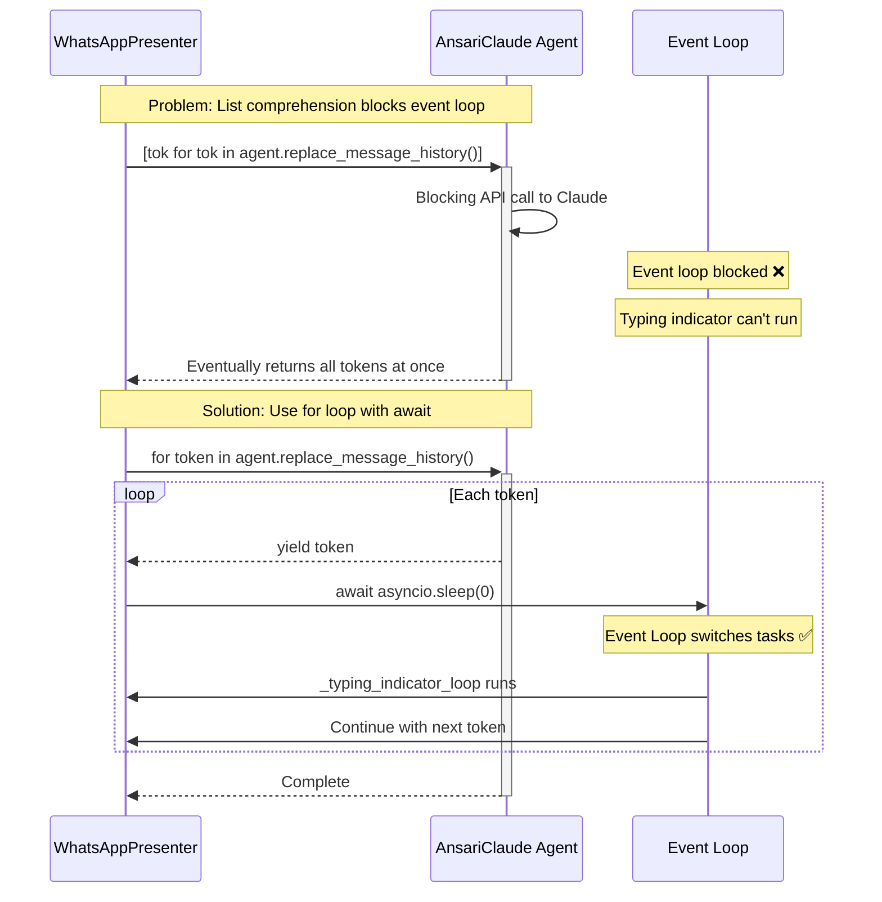
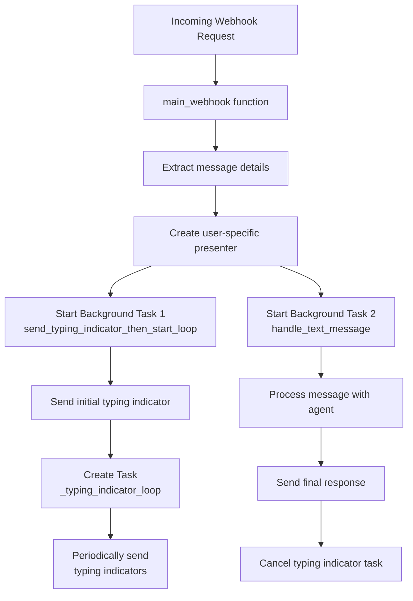
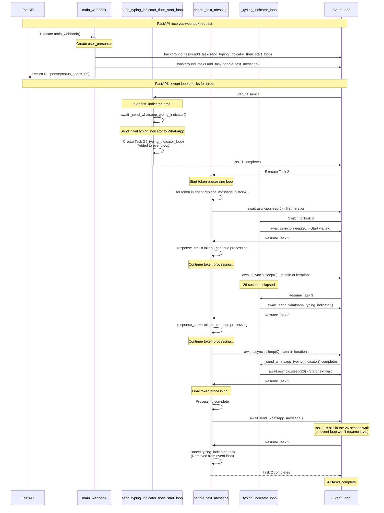

# Understanding Async Flow in WhatsApp Integration

This document explains the asynchronous execution flow in the WhatsApp integration, focusing on how control flows between `main_whatsapp.py` and `whatsapp_presenter.py`.

Note 1: to render mermaid diagrams, you can:
* Install this VSCode extension (recommended): [Markdown Preview Mermaid Support](https://marketplace.visualstudio.com/items/?itemName=bierner.markdown-mermaid)
* Alternatively, install this VSCode extension: [Markdown Preview Enhanced](https://marketplace.visualstudio.com/items/?itemName=shd101wyy.markdown-preview-enhanced)
  * Caveat, if you're in dark mode, then text in mermaid diagram will also have a dark color as well, so you may need to change the theme to light mode to see the text clearly.
  * Or, change the theme within the preview menu (bottom right when previewing) to light mode.
* Copy-paste the mermaid code to a live editor like this one: [Mermaid Live Editor](https://mermaid-js.github.io/mermaid-live-editor/)
* Check this file on GitHub (since [it can render mermaid diagrams](https://docs.github.com/en/get-started/writing-on-github/working-with-advanced-formatting/creating-diagrams))

Note 2: If you don't understand the diagrams below, then I suggest checking out the following resource(s) for more information on Python's GIL and async programming:

* Understand Python's GIL: [The Python Global Interpreter Lock (GIL): An (Almost) Love Story](https://medium.com/@amitkhachane.7/the-python-global-interpreter-lock-gil-an-almost-love-story-3acfeff99016)
* Understand async 1 (FastAPI docs): [Concurrency and async / await](https://fastapi.tiangolo.com/async/#async-and-await) (specifically starting from the `async and await` section)
* Understand async 2: [Decoding Asynchronous Programming in Python: Understanding the Basics](https://sunscrapers.com/blog/python-async-programming-basics#:~:text=concurrent%20programming)
* Undertstand async 3: [A Complete Visual Guide to Understanding the Node.js Event Loop](https://www.builder.io/blog/visual-guide-to-nodejs-event-loop#:~:text=within%20a%20callback%20function%20passed%20to)
  * Specifically, the video highlighted in the hyperlink above
* Understand async 4 (to understand the problem's root cause mentioned in this file): [mihi's SO answer](https://stackoverflow.com/a/67601373/13626137)
* Understand async/coroutines in depth: [Mastering Python Async IO with FastAPI](https://dev.to/leapcell/mastering-python-async-io-with-fastapi-13e8)
  * Highly-recommended, but stop before this section: "I/O Multiplexing Technology"
* Understand sync/async/GIL/BackgroundTasks interactions in FastAPI: FastAPI - [Why does synchronous code do not block the event Loop?](https://stackoverflow.com/a/79382844/13626137)
* Finally, using sync vs async in FastAPI: [Dead Simple: When to Use Async in FastAPI](https://hughesadam87.medium.com/dead-simple-when-to-use-async-in-fastapi-0e3259acea6f)

## Initial Concurrency Challenge and Solution - High level Overview

One of the main challenges was ensuring the typing indicator continues to run while the lengthy API call to Claude is processing:

(Note: Similar problem statement can be found on SO [here](https://stackoverflow.com/questions/67599119/fastapi-asynchronous-background-tasks-blocks-other-requests))

Below is a more detailed explanation of the solution by visualizing the control flow and how the event loop manages tasks:

## Overview of Control Flow

The WhatsApp integration uses FastAPI's background tasks and asyncio to handle message processing and typing indicators concurrently. Here's a high-level overview:

## Ultra Detailed Code Execution Flow Traced from Logs

The logs in `async_await_backgroundtasks_logs_for_tracing.log` provide clear evidence of the execution flow described in these diagrams. While the debug logs with "! Before" and "! After" markers may have been removed from the current code, they were strategically placed around critical `await` statements and task creation points to trace how control passes between different parts of the system.

Therefore, this sequence diagram shows the exact order of execution traced from the debug logs, providing a precise view of how control passes between functions and when the event loop switches between tasks:

## Key Insights

1. **FastAPI Background Tasks**: 
   - FastAPI's background tasks allow tasks to continue after the HTTP response has been sent
   - In our case, two tasks are created: typing indicator and message processing

2. **Task Creation and Execution Order**:
   - Tasks are executed in the order they're added to the event loop
   - The typing indicator task is added first, ensuring it starts before message processing

3. **Proper Yielding Points**:
   - `await asyncio.sleep(0)` is strategically placed in the token processing loop
   - This allows the typing indicator task to run periodically during message processing

4. **Task Cancellation**:
   - The typing indicator task is explicitly cancelled when message processing completes
   - This prevents the typing indicator from continuing after the response is sent

5. **The Critical Role of `async with`**:
   - `async with httpx.AsyncClient()` ensures proper asynchronous resource management
   - Both client creation and cleanup happen asynchronously without blocking the event loop

## Common Pitfalls and Solutions

| Pitfall                      | Problem                                                         | Solution                                                                      |
| ---------------------------- | --------------------------------------------------------------- | ----------------------------------------------------------------------------- |
| Blocking operations          | List comprehensions, synchronous API calls block the event loop | Replace with `for` loops and add periodic `await asyncio.sleep(0)` statements |
| Missing yield points         | Long-running operations prevent other tasks from executing      | Add strategic `await` statements to yield control                             |
| Forgotten task cancellation  | Background tasks continue running indefinitely                  | Explicitly call `task.cancel()` when the task is no longer needed             |
| Improper resource management | Using `with` instead of `async with` for async resources        | Always use `async with` for asynchronous context managers                     |
| Task execution order         | Critical tasks start too late                                   | Pay attention to the order in which tasks are added to the event loop         |

